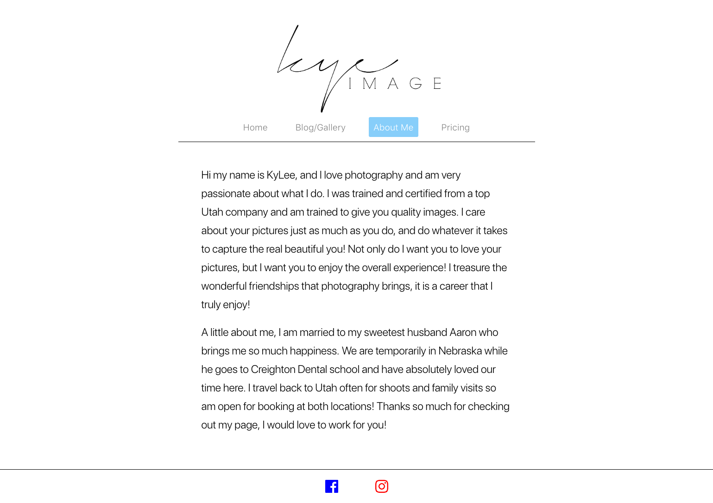
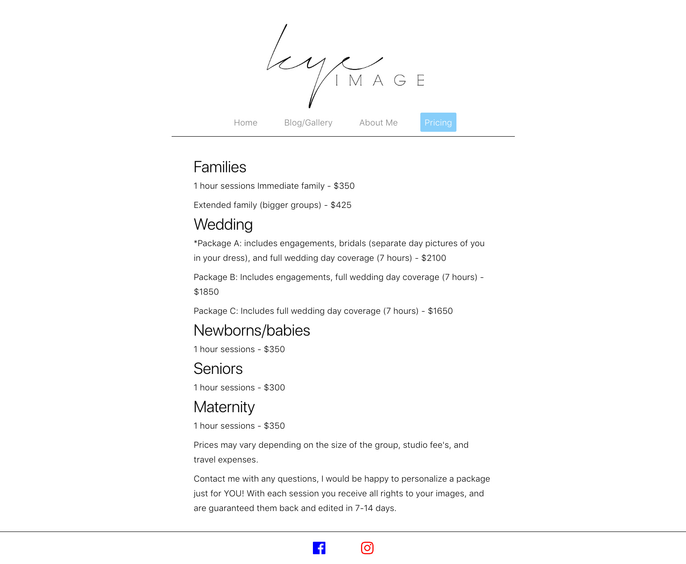
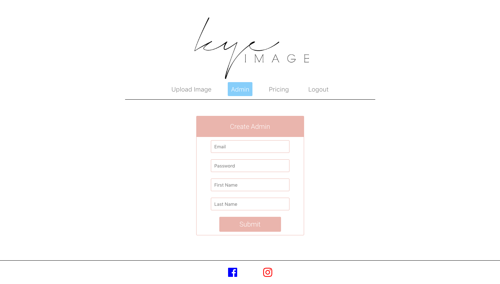
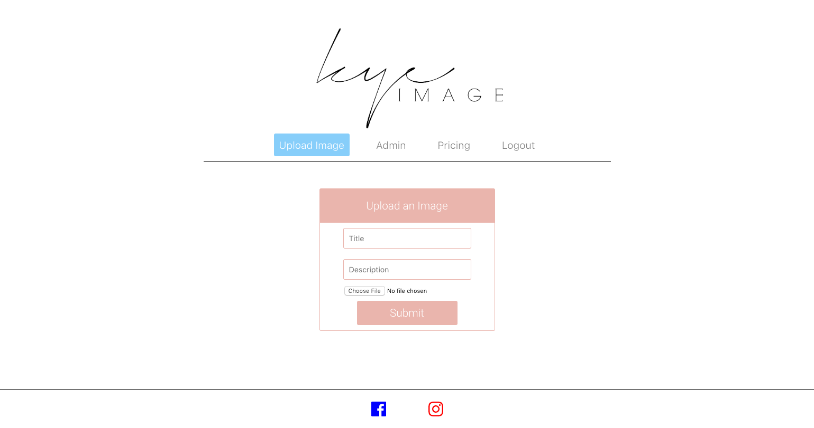
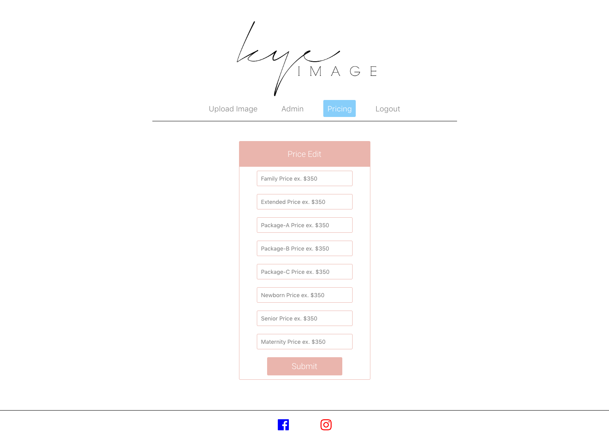

# Kye Image

## Summary

Kye Image is a photography website built for my sister's business. Learn about her business by accessing the site and reading her bio. I built the user side as well as a Admin side of the website because I wanted to give her the ability to add photos to her blog, update her pricing, and add a new admin to update the site if she ever gets too busy to do it herself.

## Demo User

To access Admin side enter endpoint /admin

#### Demo Username: Test@Test.com

#### Demo Password: Test123

## Client and Server

[Live Site](https://rocky-sea-86985.herokuapp.com/)

[Server Code](https://github.com/CaseyVandyke/kye-image-server)

## Screenshots

